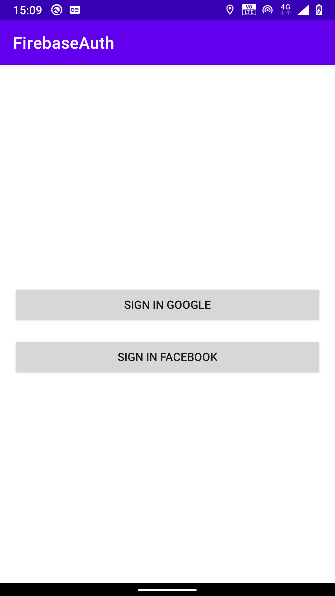
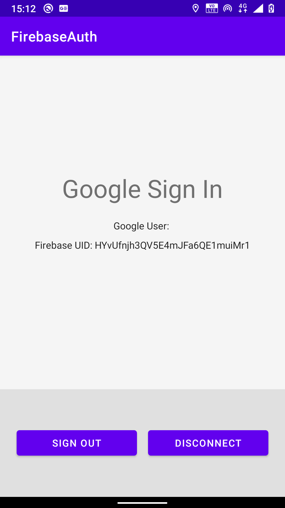
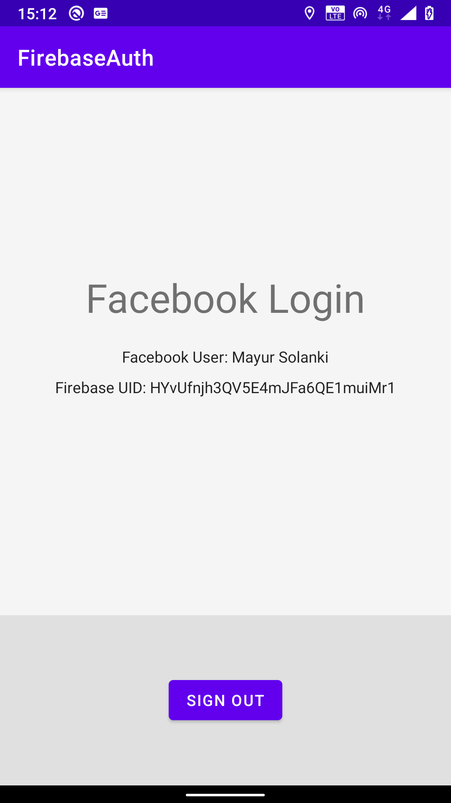

# Firebase-authenticaiton-android

Introduction
------------
Google and Facebook sign in using firebase authentication

Getting Started
---------------

-[Add Firebase to your Android Project](https://firebase.google.com/docs/android/setup).

### Google Sign In Setup

- Go to the [Firebase Console][fir-console] and navigate to your project:
  - Select the **Auth** panel and then click the **Sign In Method** tab.
  - Click **Google** and turn on the **Enable** switch, then click **Save**.
- Run the sample app on your device or emulator.
    - Select **GoogleSignInActivity** from the main screen.
    - Click the **Sign In** button to begin.

### Facebook Login Setup

- Go to the [Facebook Developers Site](https://developers.facebook.com) and follow all
  instructions to set up a new Android app.
  - When asked for a package name, use
  `com.intuz.firebaseauth.usermanagement`.
  - When asked for a main class name,
  use `com.intuz.firebaseauth.FacebookLoginActivity`.
- Go to the [Firebase Console][fir-console] and navigate to your project:
  - Select the **Auth** panel and then click the **Sign In Method** tab.
  - Click **Facebook** and turn on the **Enable** switch, then click **Save**.
  - Enter your Facebook **App Id** and **App Secret** and click **Save**.
- Open the file `app/src/main/res/values/ids.xml` and replace the value of the `facebook_app_id` with the ID of the Facebook app you just created.
- Run the app on your device or emulator.
    - Select the **FacebookLoginActivity** from the main screen.
    - Click the **Sign In** button to begin.
    - If you see text that says Facebook is disabled, make sure you are running
      either the **facebookDebug** or **facebookRelease** variants of this sample.

  
<h1>Bugs and Feedback</h1>
For bugs, questions and discussions please use the Github Issues.

 
<h1>License</h1>
The MIT License (MIT)
 
Copyright (c) 2020 INTUZ
 
Permission is hereby granted, free of charge, to any person obtaining a copy of this software and associated documentation files (the "Software"), to deal in the Software without restriction, including without limitation the rights to use, copy, modify, merge, publish, distribute, sublicense, and/or sell copies of the Software, and to permit persons to whom the Software is furnished to do so, subject to the following conditions: 
 
THE SOFTWARE IS PROVIDED "AS IS", WITHOUT WARRANTY OF ANY KIND, EXPRESS OR IMPLIED, INCLUDING BUT NOT LIMITED TO THE WARRANTIES OF MERCHANTABILITY, FITNESS FOR A PARTICULAR PURPOSE AND NONINFRINGEMENT. IN NO EVENT SHALL THE AUTHORS OR COPYRIGHT HOLDERS BE LIABLE FOR ANY CLAIM, DAMAGES OR OTHER LIABILITY, WHETHER IN AN ACTION OF CONTRACT, TORT OR OTHERWISE, ARISING FROM, OUT OF OR IN CONNECTION WITH THE SOFTWARE OR THE USE OR OTHER DEALINGS IN THE SOFTWARE.

 
<h1></h1>

